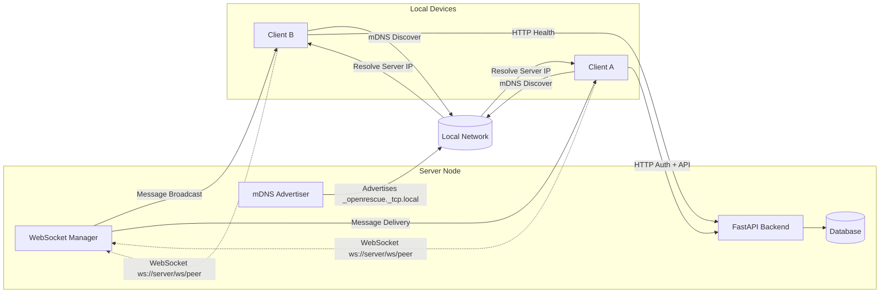

# OpenRescue

## Week 1 Architecture Overview

Local Device Communication

OpenRescue enables decentralized local communication between devices without centralized infrastructure.

Step 1 — Service Discovery

The server advertises itself using mDNS on the local network.

Clients discover the service _openrescue._tcp.local.

Step 2 — Connection

Client A and Client B resolve the server IP automatically.

They connect to the backend using WebSockets:

ws://<server-ip>:8000/ws/peer

Step 3 — Messaging

Client A sends a JSON message.

The FastAPI WebSocket manager receives it.

The server broadcasts the message to connected peers.

Example flow:

Client A → WebSocket → Server → WebSocket Manager → Client B

Step 4 — Offline Support

Messages are stored in the database if the recipient is offline.

Delivered when the device reconnects.

Week 1 Implementation Status

Implemented components:

FastAPI backend

JWT authentication

CAP XML parser

Incident management system

Responder assignment

WebSocket messaging

mDNS local discovery

Documentation:

Additional technical documentation is available:

docs/week1_demo.md

docs/week1_architecture.mmd

OpenRescue is a decentralized emergency system designed for community resilience without relying on centralized or proprietary points of failure. The goal is to provide a robust framework combining high-performance backends and real-time collaboration.

## Features
- **FastAPI Backend**: Asynchronous and lightweight server, capable of real-time communication.
- **PostgreSQL & PostGIS**: Geospatial data handling capability allowing full mapping functionality independent of single providers.
- **Local Network Discovery**: Decentralized peer-to-peer capabilities leveraging mDNS without centralized DNS.
- **Redis Cache**: High throughput Pub/Sub mechanism.

## License & Architectural Sovereignty

The OpenRescue project is explicitly 100% open-source software and heavily emphasizes Architectural Sovereignty. 

**License:**  
This software is licensed under the [GNU General Public License v3.0 (GPL-3.0)](LICENSE) or later. The GPL guarantees end users the freedom to run, study, share, and modify the software, aligning completely with the FOSS principles governing the design of the project.

**Architectural Sovereignty:**  
We commit to avoiding all proprietary APIs or third-party locked-in services. 
- **NO Google Maps APIs.** Instead, we use open standards like OpenStreetMap tools and postgis indexing for geographical features.
- **NO Firebase or Proprietary Push Mechanics.** Communications are orchestrated via self-hosted Redis, WebSockets, and P2P structures like mDNS.

By enforcing these constraints, OpenRescue guarantees deployment flexibility and long-term sustainability without vendor lockdown.

## Quick Start
1. Copy `.env.example` to `.env` and configure securely.
2. Build and run via `docker compose up -d --build`.
