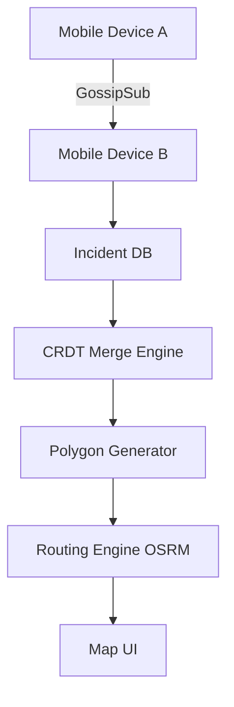
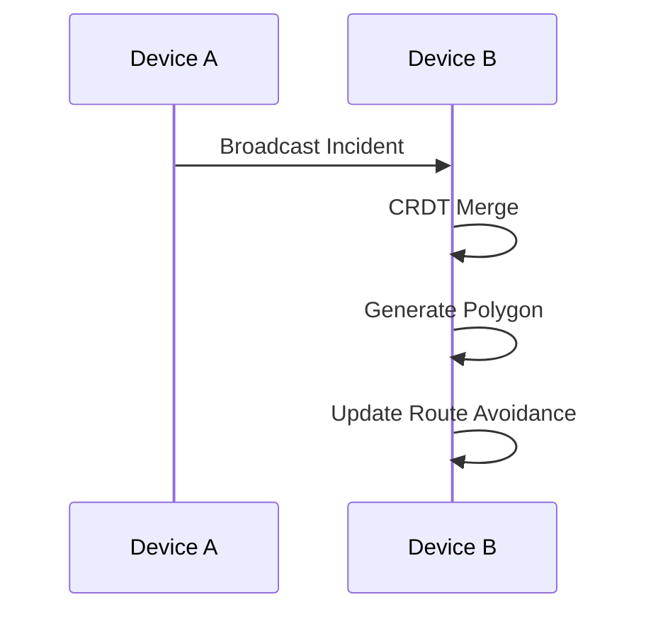

# OpenRescue
## Offline-First Emergency Coordination System

> "Built for when the internet fails — enabling real-time emergency coordination through decentralized, offline-first technology"

---

### The Problem: When Every Second Counts, Centralized Systems Fail

In the aftermath of a disaster, centralized communication infrastructure is the first to collapse. Fiber lines are cut, cell towers lose power, and the internet becomes an unreliable luxury. When this happens:
- **Centralized systems fail** precisely when they are most needed.
- **Coordination breaks down**, leaving responders and victims in isolation.
- **Response times increase**, directly impacting lives.

**OpenRescue rethinks emergency response by removing dependence on centralized infrastructure.**

---

### Key Features (Human + Tech Blend)

**Offline Maps**
→ Maps remain available even without internet
→ Implemented using **tile prefetch** logic + a **local file tile provider** leveraging MBTiles.

**Offline Routing (OSRM)**
→ Responders get navigation even in dead zones
→ Powered by a **local OSRM engine** running in Docker, processing OpenStreetMap data entirely offline.

**P2P Incident Sync**
→ Information spreads like fire across the network
→ Leverages **libp2p GossipSub** for decentralized incident broadcasting across the mesh.

**CRDT-Based Conflict Resolution**
→ Multiple updates, one certain truth
→ Uses **Conflict-free Replicated Data Types (CRDTs)** to ensure all devices converge to the same state without a central server.

**Deterministic Danger Zones**
→ Visual safety boundaries that match on every device
→ Derived using **pure geometric functions**, ensuring identical polygons are generated from the same incident data without network overhead.

---

### Tech Stack (Why each matters)

**Flutter**
→ Provides a **high-performance, cross-platform UI** for rapid deployment on both responder and civilian devices.

**OSRM (Open Source Routing Machine)**
→ Enables **fully offline routing** using local map data, critical for navigation when external APIs (like Google Maps) are unreachable.

**Go (libp2p)**
→ Powers the **decentralized peer-to-peer communication** layer, allowing devices to form an ad-hoc mesh network automatically.

**Drift (SQLite)**
→ A reactive **local database** providing the foundation for our offline-first persistence and state management.

---

### Why OpenRescue Stands Out

- **Works Without Internet**: Every core feature—mapping, routing, and sync—is designed for air-gapped environments.
- **No Central Server Required**: The system forms an autonomous mesh; the more devices join, the stronger the network becomes.
- **Deterministic Polygon Sync**: Eliminates geometric divergence across devices by calculating danger zones locally and identically.
- **CRDT-Based Convergence**: Guarantees that even with out-of-order messages, every responder sees the same operational picture.

---

### Architecture Overview

"This system is designed as a fully decentralized mesh where every device acts as both client and server."

#### Data Flow

---

### Example Scenario: Flood Response

**The Scenario:** A sudden flash flood knocks out local cell towers. 
1. **Report:** A responder on the ground (Device A) scouts a submerged bridge and creates an incident.
2. **Sync:** Because Device A is part of the OpenRescue mesh, the incident is instantly broadcast to Device B (a block away) via P2P.
3. **Adapt:** Device B's routing engine immediately detects the new "Danger Zone" and reroutes the responder to a safer path.
4. **Result:** Real-time coordination continues purely over the ad-hoc network, saving critical minutes.

---

### How It Works (The 5-Step Flow)

1. **Incident Created**: Data is captured locally and given a causal timestamp (Lamport clock).
2. **Broadcast via P2P**: The incident propagates through the libp2p GossipSub network.
3. **CRDT Merge**: Incoming data is merged into the local Drift database with deterministic conflict resolution.
4. **Polygon Generated**: The system derives a hazard area (polygon) around the incident coordinates.
5. **Routing Updated**: The offline OSRM engine adjusts routes to avoid newly identified hazard polygons.

---

### FOSS Compliance

OpenRescue is built on **Architectural Sovereignty**:
- **100% Open-Source**: Every layer—from Flutter to Go—is fully FOSS compliant.
- **No Proprietary APIs**: No Google Maps, Firebase, or closed SDKs.
- **Fully Offline**: Designed to work where big-tech infrastructure ends.

---

### How to Run

1. **OSRM Setup**: `docker compose -f docker-compose.osrm.yml up`
2. **Go P2P Node**: Located in `backend/p2p-node/`, run `go run main.go`
3. **Flutter App**: `cd mobile_app && flutter run`

---

Licensed under [GPL-3.0](LICENSE).
© OpenStreetMap contributors
