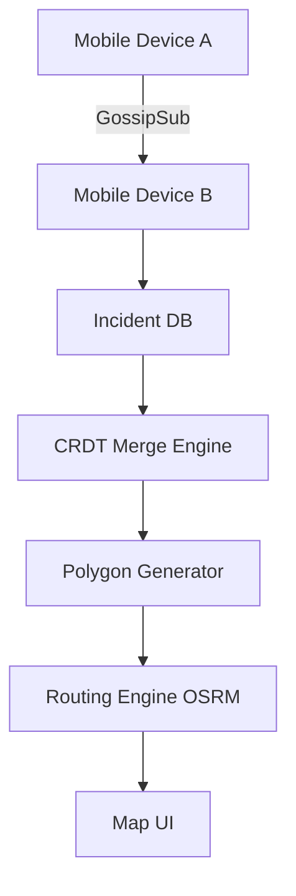
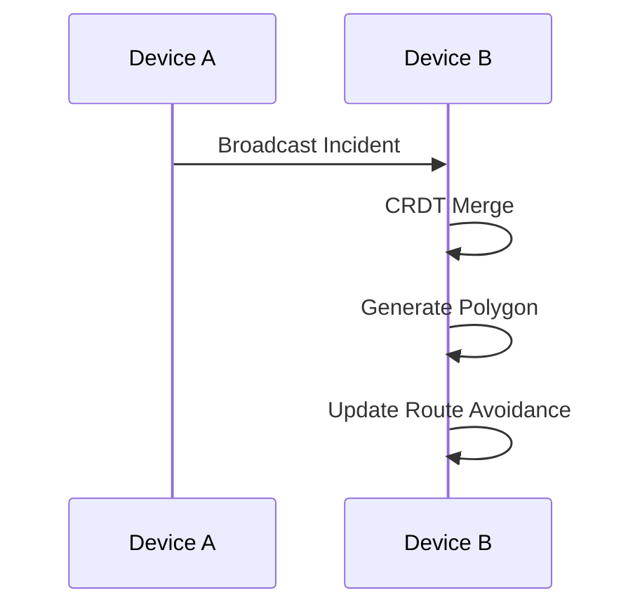

<!-- Badges -->


# OpenRescue
**Built for when the internet fails — real-time emergency coordination through decentralized, offline-first technology.**

---

### [**🎬 Watch the 2-Minute Pitch/Demo Video**](#)

<p align="center">
  
  
</p>

---

## Table of Contents
- [The 'Oh Crap' Scenario](#the-oh-crap-scenario)
- [Key Features (Show, Don't Tell)](#key-features-show-dont-tell)
- [Architecture Deep Dive](#architecture-deep-dive)
- [Tech Stack](#tech-stack)
- [Frictionless Quickstart](#frictionless-quickstart-developer-experience)
- [Hackathon Journey & Roadmap](#hackathon-journey--roadmap)
- [Closing & License](#closing--license)

---

## The 'Oh Crap' Scenario

In the aftermath of a disaster, centralized communication infrastructure is the first to collapse. Fiber lines are cut, cell towers lose power, and the internet becomes an unreliable luxury. When this happens:
- **Centralized systems fail** precisely when they are most needed.
- **Coordination breaks down**, leaving responders and victims in isolation.
- **Response times increase**, directly impacting lives.

**OpenRescue is not just software—it's a life-saving tool.** It rethinks emergency response by removing dependence on massive centralized infrastructure, empowering first responders to coordinate effectively even in absolute dead zones.

---

## Key Features (Show, Don't Tell)

*   **Offline Maps**: *Ground truth is always visible.* Maps remain fully available without internet, implemented using tile prefetch logic and a durable local file tile provider leveraging MBTiles.
*   **Offline Routing via OSRM**: *Navigating around hazards in a dead zone.* Powered by a local OSRM engine running in Docker. Responders get critical routing utilizing OpenStreetMap data entirely offline.
*   **P2P Incident Sync via libp2p**: *Information spreads like fire across the network.* Leverages robust libp2p GossipSub for instant decentralized incident broadcasting across the mesh.
*   **CRDT Conflict Resolution**: *Multiple chaotic updates condense into one truth.* Uses Conflict-free Replicated Data Types (CRDTs) to ensure all devices converge to the exact same state locally without ever touching a central server.
*   **Deterministic Danger Zones**: *Universal situational awareness.* Visual safety boundaries are derived using pure geometric functions, ensuring identical polygons are generated from the same incident data across all devices without any network overhead.

---

## Architecture Deep Dive

<details>
<summary><b>View System Architecture & Data Flow</b></summary>

### System Layout

"This system is designed as a fully decentralized mesh where every device acts as both client and server."



### Core Module Connections

```mermaid
flowchart LR

%% Devices
A[Flutter App Device A]
B[Flutter App Device B]

%% Core Mobile Components
A --> A1[Local DB (Drift)]
A --> A2[Polygon Generator]
A --> A3[Routing Controller]

B --> B1[Local DB (Drift)]
B --> B2[Polygon Generator]
B --> B3[Routing Controller]

%% P2P Layer
A -->|Broadcast Incident| P2P[Go libp2p Daemon]
P2P -->|GossipSub Sync| B

%% CRDT + Sync
B --> B4[CRDT Merge Engine]
A --> A4[CRDT Merge Engine]

%% Polygon Generation
A4 --> A2
B4 --> B2

%% OSRM Routing
A3 --> OSRM[OSRM Server (Local)]
B3 --> OSRM

%% Tile System
A --> Tiles[Offline Tile Storage]
B --> Tiles

%% Map Rendering
Tiles --> Map[Flutter Map UI]
OSRM --> Map

%% Optional Backend
A -->|Optional API| FastAPI[FastAPI Backend]
B -->|Optional API| FastAPI

FastAPI -->|Metadata / Extensions| A
FastAPI -->|Metadata / Extensions| B
```

### Data Flow


</details>

---

## Tech Stack

*   **Flutter**: Provides a **high-performance, cross-platform UI** ensuring we can rapidly deploy to any responder or civilian device in the field.
*   **Go (libp2p)**: The engine of our **decentralized peer-to-peer communication** layer, allowing ad-hoc mesh networking that works seamlessly without a central broker.
*   **OSRM (Open Source Routing Machine)**: Enables **fully offline routing** using local map data, critical for navigation when external APIs (like Google Maps) are completely unreachable.
*   **Drift (SQLite)**: *Why Drift?* Reactive local storage ensures our mobile UI immediately updates the second P2P data syncs and CRDTs merge, giving a flawless reactive experience.

---

## Frictionless Quickstart (Developer Experience)

We've made it as bulletproof as possible to boot up the entire decentralized stack.

### Prerequisites
- Docker & Docker Compose
- Flutter SDK
- Go 1.21+

> ⚠️ **Crucial Network Note:** The Flutter mobile app needs to connect to the local OSRM and Go P2P nodes. If running on a physical device or emulator, ensure your config environment points to your machine's **local network IP address** (e.g., `192.168.1.X`), not `localhost`!

### Step 1: Spin up Local Offline Routing (OSRM)
Get the routing engine running on offline OpenStreetMap data. 
```bash
docker compose -f docker-compose.osrm.yml up -d
```

### Step 2: Run the Go P2P Node
Start the decentralized mesh network daemon.
```bash
cd backend/p2p-node/
go run main.go
```

### Step 3: Run the Flutter App
Launch the responder interface.
```bash
cd mobile_app
flutter run
```

---

## Hackathon Journey & Roadmap

### Challenges We Conquered
Building a completely decentralized mobile system is inherently challenging. Our biggest victory was guaranteeing **CRDT convergence over an unreliable P2P mesh**. We had to ensure that when devices reconnect after intermittent signal drops, their incident polygons update deterministically without creating duplicate or fragmented hazard zones.

### What's Next 🚀
*   **Hardware Integration**: Extending the P2P layer over **LoRaWAN** to cover massive distances during complete cellular blackouts.
*   **Battery Optimization**: Throttling GossipSub broadcasts intelligently to save crucial responder device battery life in extended scenarios.
*   **Mesh Bridging**: Allowing devices with satellite uplinks to act as temporary gateways for the rest of the offline mesh.

---

## Closing & License

OpenRescue is built with **Architectural Sovereignty**: 
- **100% Open-Source**: Every layer is fully FOSS compliant.
- **No Proprietary APIs**: No Google Maps, Firebase, or closed SDKs.
- **Fully Offline**: Designed to work where big-tech infrastructure ends.

Licensed under [GPL-3.0](LICENSE).  
© OpenStreetMap contributors  
*Hackathon built. Real-world ready.*
