<!-- 1. Top Badges -->


<!-- 2. Hero Section -->
<div align="center">
  
</div>

<!-- 3. Title & Tagline -->
# OpenRescue

> **Built for when the internet fails — enabling real-time emergency coordination through decentralized, offline-first technology.**

## System Workflows Overview

"OpenRescue is built as a decentralized, offline-first system where each component plays a critical role in ensuring reliability during network failures. The following diagrams break down how data flows across the system."

### 1. Complete System Architecture

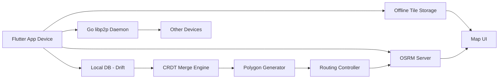

"This diagram shows how each device operates independently while still syncing with nearby devices using peer-to-peer communication."

### 2. Peer-to-Peer Incident Sync

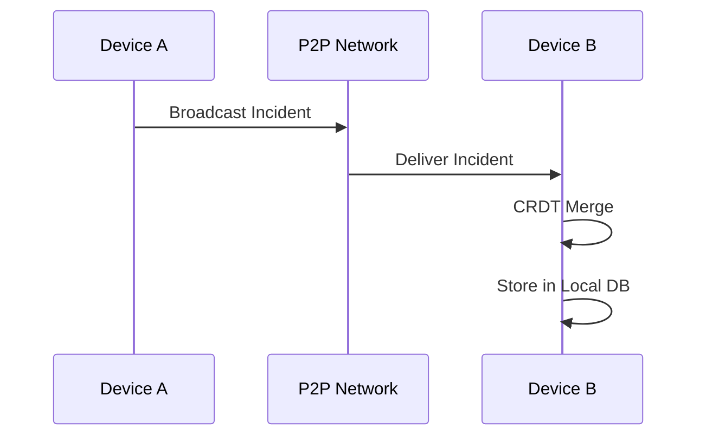

"Incidents are broadcast over a decentralized mesh network, ensuring data reaches nearby devices without any central server."

### 3. Conflict Resolution & Sync (CRDT + HEAD)

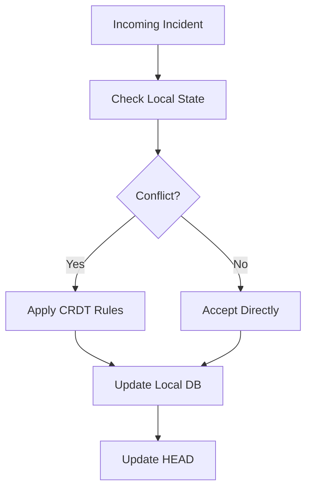

"This ensures all devices converge to the same state without conflicts, even if updates arrive out of order."

### 4. Deterministic Danger Zone Generation

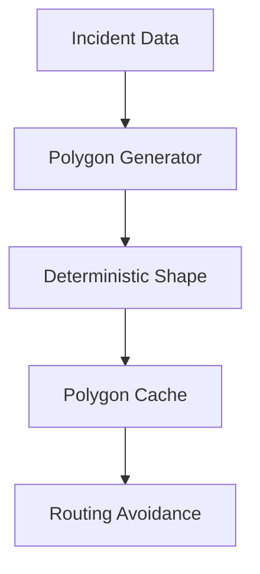

"Polygons are generated locally using deterministic logic, ensuring all devices produce identical danger zones without sharing geometry."

### 5. Offline Routing with OSRM

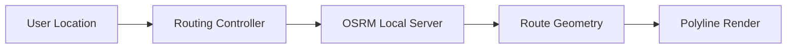

"Routing is computed locally using OSRM, allowing navigation even without internet connectivity."

### 6. Offline Map System

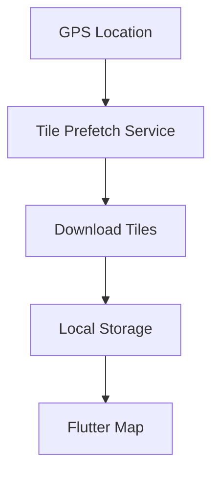

"Map tiles are downloaded in advance and stored locally, enabling seamless offline map usage."

---

<!-- 5. Table of Contents -->
## Table of Contents
- [The "Oh Crap" Scenario](#the-oh-crap-scenario)
- [Key Features (Show, Don't Tell)](#key-features-show-dont-tell)
- [Architecture & Data Flow](#architecture--data-flow)
- [Tech Stack](#tech-stack)
- [Frictionless Quickstart](#frictionless-quickstart)
- [Hackathon Journey & Roadmap](#hackathon-journey--roadmap)
- [Closing & License](#closing--license)

---

<!-- 6. The "Oh Crap" Scenario -->
## The "Oh Crap" Scenario

In the aftermath of a disaster, centralized communication infrastructure is the first to collapse. Fiber lines are cut, cell towers lose power, and the internet becomes an unreliable luxury. When this happens, **centralized systems fail precisely when they are most needed**. Coordination breaks down, leaving responders and victims in isolation, drastically increasing response times and directly impacting lives.

**OpenRescue is not just software—it's a life-saving tool.** It rethinks emergency response by removing dependence on a central point of failure. It empowers first responders to collaborate effectively even in absolute dead zones, where traditional technology fails.

---

<!-- 7. Key Features -->
## Key Features (Show, Don't Tell)

*   🗺️ **Offline Maps**: *Ground truth is always visible.* Pre-fetched tiles and an MBTiles provider mean mapping is fully functional without internet.
*   🧭 **Offline Routing via OSRM**: *Navigating around hazards in a dead zone.* Powered by a local Docker-based OSRM engine utilizing OpenStreetMap data entirely offline.
*   📡 **P2P Incident Sync via libp2p**: *Information spreads like fire across the network.* Leverages robust GossipSub mesh networking to automatically broadcast incident reports to nearby peers.
*   🔗 **CRDT Conflict Resolution**: *Multiple chaotic updates condense into one truth.* Uses Conflict-free Replicated Data Types (CRDTs) to ensure eventual consistency locally without ever touching a central server.
*   ⚠️ **Deterministic Danger Zones**: *Universal situational awareness.* Hazard polygons are computed identically across all devices using pure geometric functions, ensuring safety bounds match without network overhead.

---

<!-- 8. Architecture & Data Flow -->
## Architecture & Data Flow

<details>
<summary><b>🌐 Diagram 1: The Ad-Hoc Mesh Network Topology</b></summary>

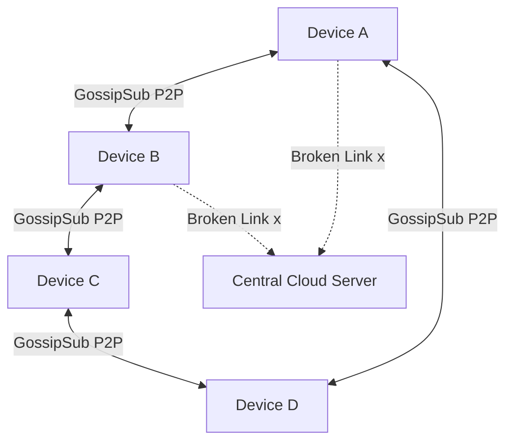

</details>

<details>
<summary><b>🛠️ Diagram 2: The Local Device Stack (Flutter + Go + OSRM)</b></summary>

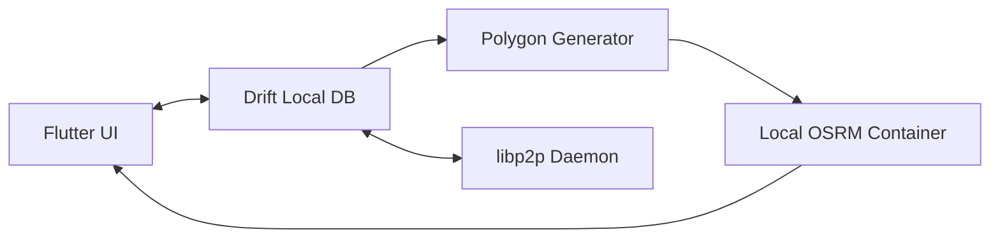

</details>

<details>
<summary><b>🔄 Diagram 3: CRDT Conflict Resolution (How 2 Devices Merge Truth)</b></summary>

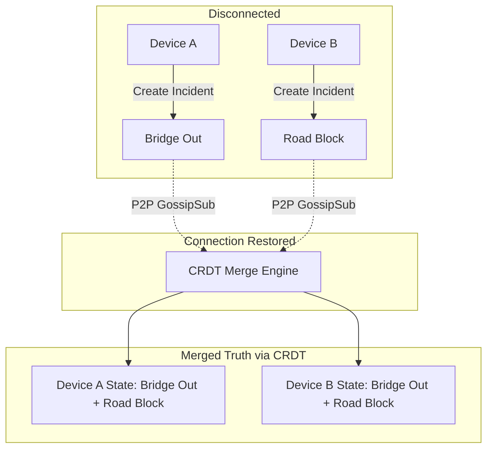

</details>

<details>
<summary><b>⚠️ Diagram 4: Deterministic Danger Zone Generation</b></summary>

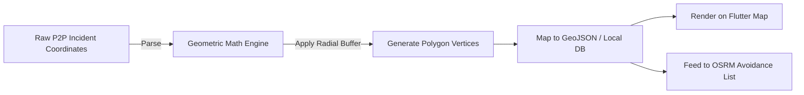

</details>

<details>
<summary><b>📡 Diagram 5: P2P Incident Propagation Sequence</b></summary>

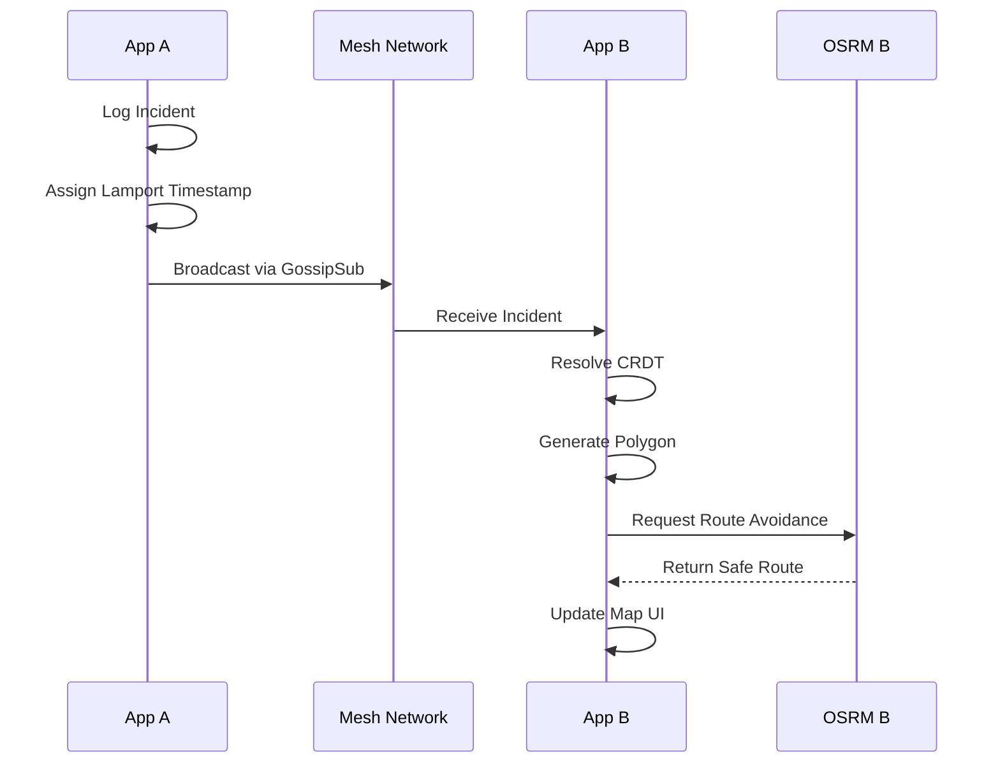

</details>

<details>
<summary><b>⚡ Diagram 6: System Lifecycle & Offline Fallback</b></summary>

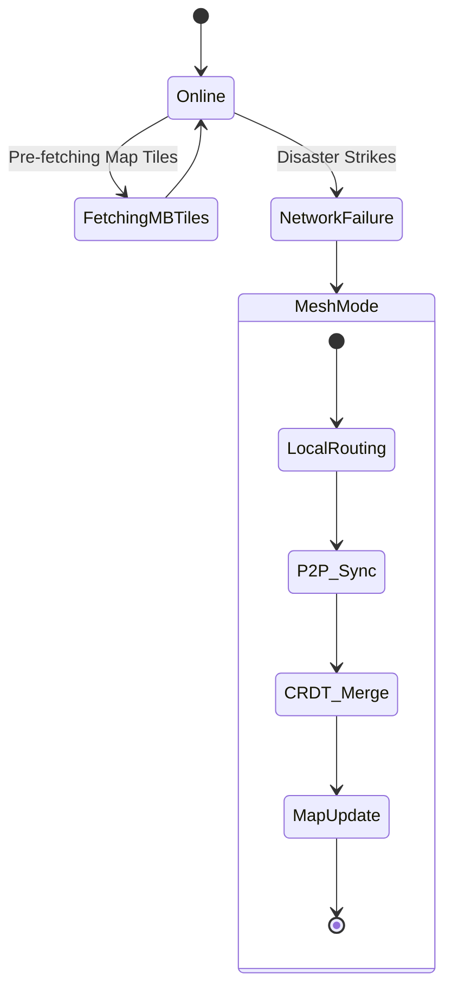

</details>

---

<!-- 9. Tech Stack -->
## Tech Stack

*   **Flutter**: Provides a **high-performance, cross-platform UI** ensuring we can rapidly deploy a unified responder interface to any mobile device in the field.
*   **Go (libp2p)**: The powerhouse behind our **decentralized peer-to-peer communication** layer, allowing ad-hoc mesh networking that works seamlessly without a central broker.
*   **OSRM (Open Source Routing Machine)**: Enables **fully offline routing** using raw local map data to dynamically calculate safe paths when external APIs are completely unreachable.
*   **Drift (SQLite)**: *Why Drift?* Reactive local storage ensures our mobile UI immediately updates the second P2P data syncs and CRDTs effectively merge, giving responders a flawless real-time experience.

---

<!-- 10. Frictionless Quickstart -->
## Frictionless Quickstart

We've made it as bulletproof as possible to boot up the decentralized stack locally.

### Prerequisites
- Docker & Docker Compose
- Flutter SDK
- Go 1.21+

> ⚠️ **Crucial Network Note:** The Flutter mobile app must connect to the machine's **local network IP address** (e.g., `192.168.1.X`), not `localhost`! If running on a physical device or emulator, update your config accordingly.

### Step 1: Spin up Local OSRM
Start the local offline routing engine.
```bash
docker compose -f docker-compose.osrm.yml up -d
```

### Step 2: Run Go P2P Node
Launch the decentralized mesh network daemon.
```bash
cd backend/p2p-node/ && go run main.go
```

### Step 3: Run Flutter App
Start the responder mobile interface.
```bash
cd mobile_app && flutter run
```

---

<!-- 11. Hackathon Journey & Roadmap -->
## Hackathon Journey & Roadmap

### Challenges We Conquered
Building a fully decentralized mesh system is inherently difficult. Our biggest hurdle was guaranteeing **CRDT convergence over flaky P2P connections**. Ensuring that incident states deterministically matched across all devices—without duplicate or orphaned polygons when reconnecting after signal drops—required intense synchronization logic. We also had to heavily focus on battery drain optimization since constant mesh broadcasting severely impacts mobile devices.

### What's Next 🚀
*   **Hardware Integration**: Extending the P2P layer over **LoRaWAN** hardware modules to cover massive geographical distances during complete cellular grid blackouts.
*   **Drone Node Relays**: Integrating aerial drones to act as temporary high-altitude P2P mesh relay points, expanding network coverage to otherwise isolated ground units.

---

<!-- 12. Closing & License -->
## Closing & License

OpenRescue is built with **Architectural Sovereignty**: 
- **100% Open-Source**: Every layer is fully FOSS compliant.
- **No Proprietary APIs**: No Google Maps, Firebase, or closed SDKs.
- **Fully Offline**: Designed to work where big-tech infrastructure ends.

Licensed under the [GPL-3.0 License](LICENSE).  
© OpenStreetMap contributors  
*Hackathon built. Real-world ready.*
